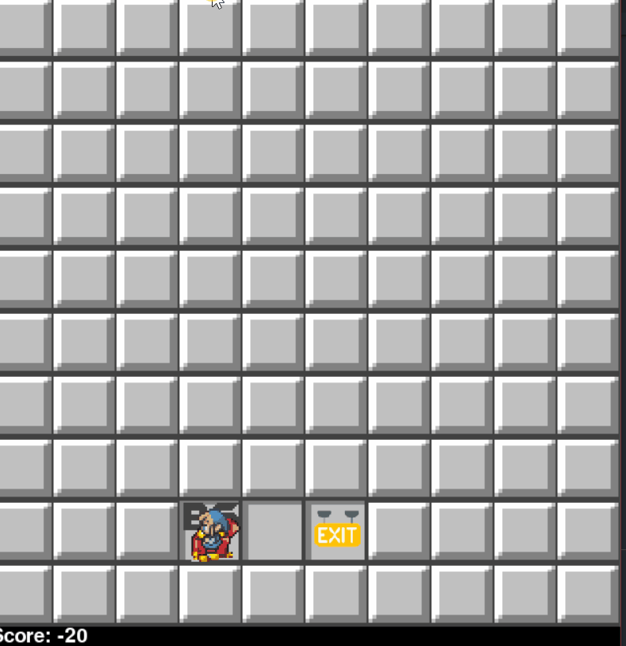
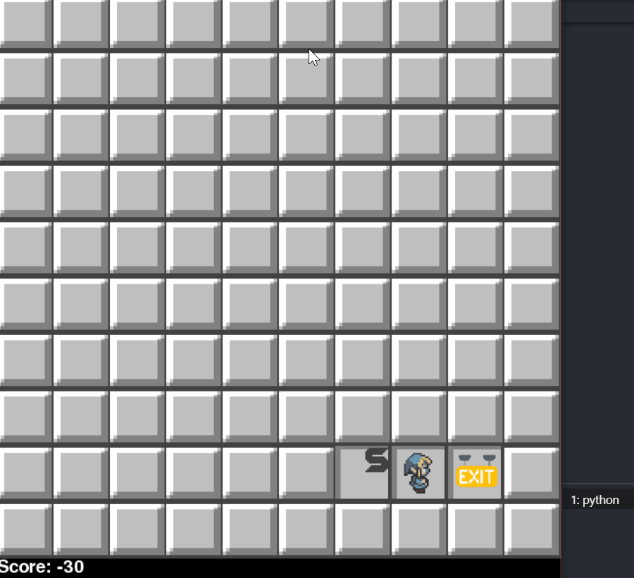
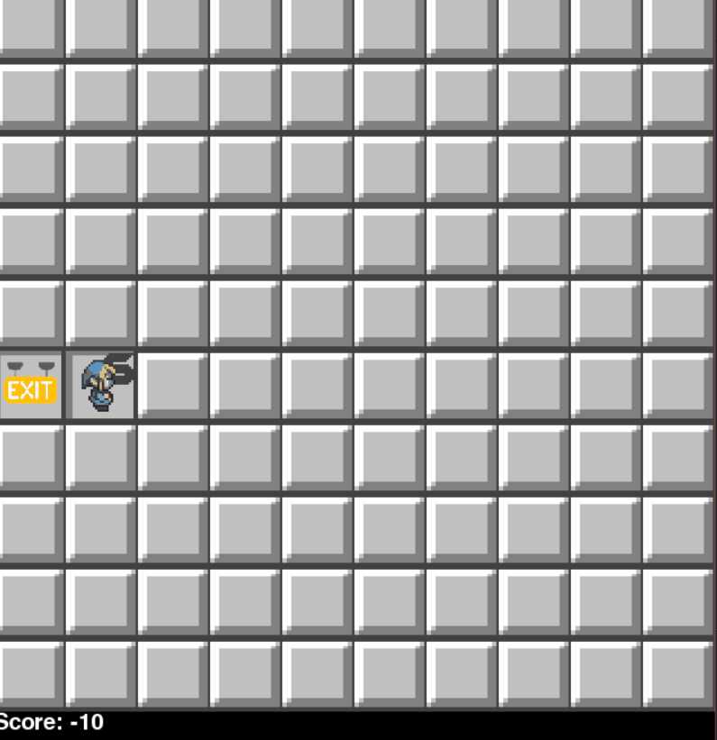

# Demo project 02 - Wumpus World

## Automatic mode:

- This mode will run the program automatically and print the records of each action in 'log.txt'
- 

## Manual mode:

- In this modes, user can observe clearly each action of the agent, description is printed out and displayed on the GUI
- 

## Some reflection about the work:

### Shooting arrows: 

- Agent decides to shoot to check the next tile to check the next room
- This is still not really efficient since the agent loses some points when shooting the wumpus and gain nothing

### Being stuck

- When being stuck and the agent tends to play safely. Therefore, it chooses to exit the cave when there is no safe place. 
- 

